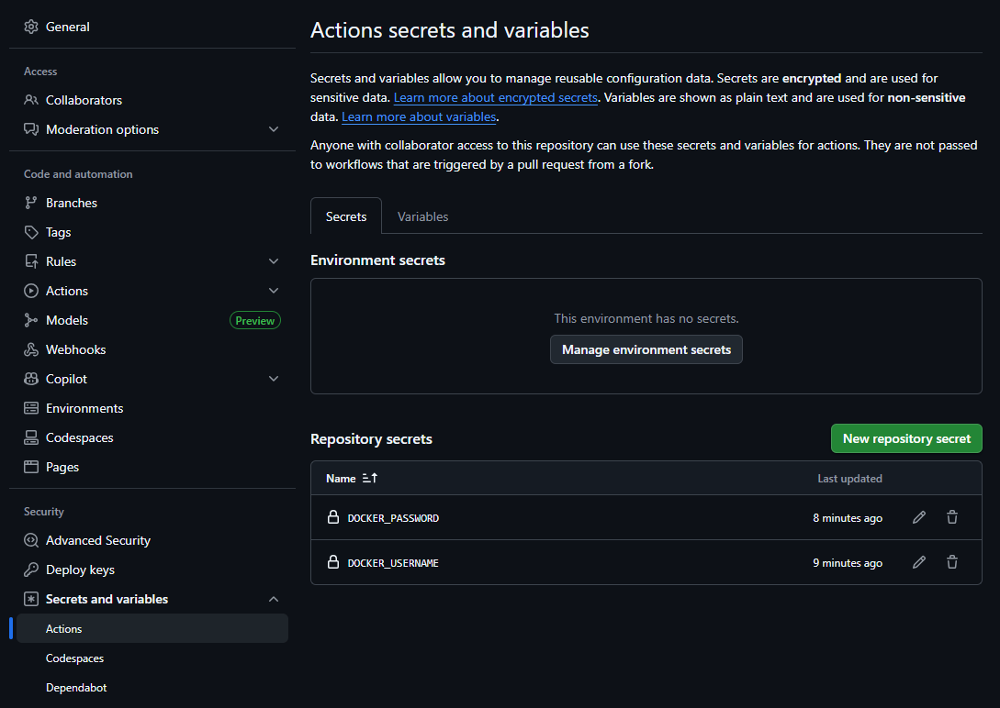
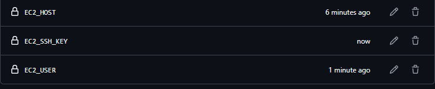

# CI/CD

### 파일 생성하기
- src/main/java
  - com.test.team.controller
    - MainController.java
  - com.test.team.repository
    - TestRepository.java
    - TeamRepository.java(I)
  - com.test.team.entity
    - Team.java
- templates
  - index.html
  - list.html
- src/test/java
  - com.test.team.repository
    - TestRepositoryTests.java

---
### CI/CD란...
- Continuous Integration
- Continuous Delivery/Deployment
- 로컬(개발) → 커밋 → GitHub(저장소) → DockerHub(이미지) → AWS EC2(배포+실행)

#### AWS에 배포해보기(DB 없이)
1. 로컬(개발)
2. 프로젝트 -> GitHub 연결하기
   1. 협업 목적
   2. 지속적인 통합/배포(CI/CD)
3. Docker -> 현재 프로젝트를 컨테이너 이미지로 만들기
   1. 프로젝트 루트에 Dockerfile 생성
4. GitHub Actions
   1. 저장소에 push가 발생되면 미리 준비한 행동을 실행하는 도구
5. GitHub Actions Workflow 파일 생성 ~ DockerHub 업로드
   1. `.github/workflows` 디렉토리 생성
   2. 해당 디렉토리 내에 `hello.yaml` 생성(테스트용)
   3. 프로젝트용 Workflow 파일 생성(`ci-cd.yaml`)
   4. push 발생 -> 해당 브랜치(main) checkout -> 소스 읽기 -> JDK 구축 -> Gradle 빌드 -> *.jar -> Dockerfile -> 컨테이너 이미지 생성 -> 도커허브에 업로드
   5. 도커에서 토큰 생성 및 GitHub Actions Secret 등록<br>
       <br>
      
   6. GitHub에 push하면 도커 이미지까지 생성이 완료되고, DockerHub-Repositories에서 확인할 수 있다.
6. 도커허브의 이미지를 다운로드 + 실행
   ```bash
   $ docker image pull hikigirl/team
   $ docker run -d --name team -p 8080:8080 hikigirl/team
   $ docker ps
   ```
7. CD 구현하기
   1. 도커허브 이미지 -> EC2에서 내려받기 -> 컨테이너 실행
   2. GitHub Actions secrets 등록<br>
      1. Public IP, *.pem, EC2 ID를 등록한다.
      
   3. EC2 인스턴스의 ip - 8080 포트로 접속하면 내가 만든 사이트가 보인다.
   4. 이제 git에 push만 하고 기다리면 새로 수정한 내용이 반영된다.
8. 단위 테스트 추가하기
   1. 테스트 파일들 생성
9. 단위 테스트 + GitHub Action
   1. 단위 테스트가 성공하면 -> 문제 x
   2. 단위 테스트가 실패해서 배포도 실패했을 경우
      1. push 당사자에게 Github Issue를 생성해 전달하기
      2. Issue 생성하기 위한 권한 필요(yaml에서 수정)
      3. Issue 작성 위한 템플릿 작성: `.github/TEST_FAILURE_TEMPLATE.md`
      4. 이슈 작성 workflow 추가

---
#### AWS에 배포해보기(DB O)
1. 기존 프로젝트 + 오라클 연동(JPA)
   1. 로컬 개발 -> 로컬 오라클
2. Docker Compose
   1. Spring Boot 컨테이너 + Oracle 컨테이너
   2. 프로젝트 루트: docker-compose.yaml